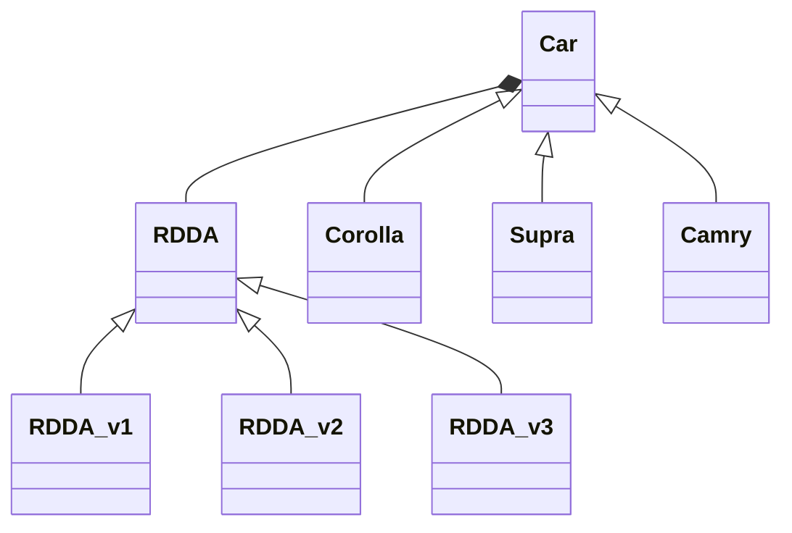

# Strategy

This Design Patterns allows you to dynamically configure a given instance
with a behavior (function, methods) coming from another instance.

## Implementation

Thanks to mermaid diagrams, I can now give an implementation example using class diagrams.
Here it is :

I've basically designed Cars and each one is given a particular strategy
to compute the remaining driving distance.

The algorithms implemented doesn't worth much, but the concept is presented.

RDDA stands for **R**emaining **D**riving **D**istance **A**lgorithm.