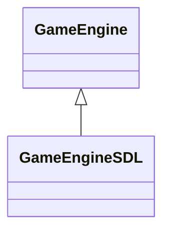

# component

## definitions

General definition : 

> Allow a single entity to span multiple domains without coupling the domains to each other.

Definition from the book :

> A single entity spans multiple domains. To keep the domains isolated, the code for each is placed
> in its own component class. The entity is reduced to a simple container of components.

Personal definition :  

> If an entity handles multiple domains, create separated/isolated components so that this
> entity will incorporate them (like a container) to safely use them.

## explanations

There is not much of additional explanations here, the goal is separate the domains
by having dedicated classes and use them in another class as instance members.

## implementation

### introduction

For the implementation, I will go a bit beyond what is usually implemented,
I will implement a snake game called "cpp-snake".

It will allow me to see how we this pattern suit for a real world example.

### cpp-snake 🐍

cpp-snake is a clone of the iconic snake game available on [Nokia 3310](https://en.wikipedia.org/wiki/Nokia_3310).

#### gameplay

Using the keyboard arrows ⬆️⬇️➡️⬅️, move the snake to eat as much food
as possible while not eating yourself.

#### game engine

#### design

Here are the components which will be developed:
- InputComponent
- GraphicsComponent
- PhysicsComponent
- Snake
- World
- Score
- etc.

