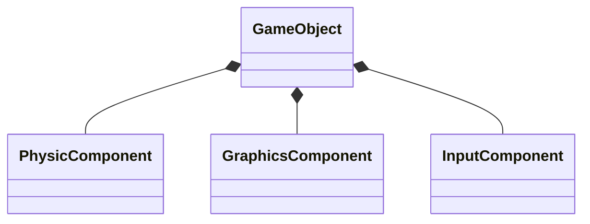
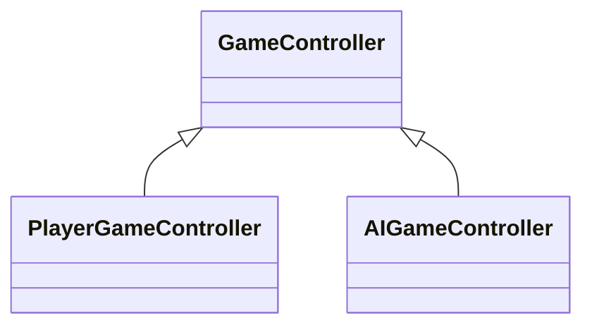
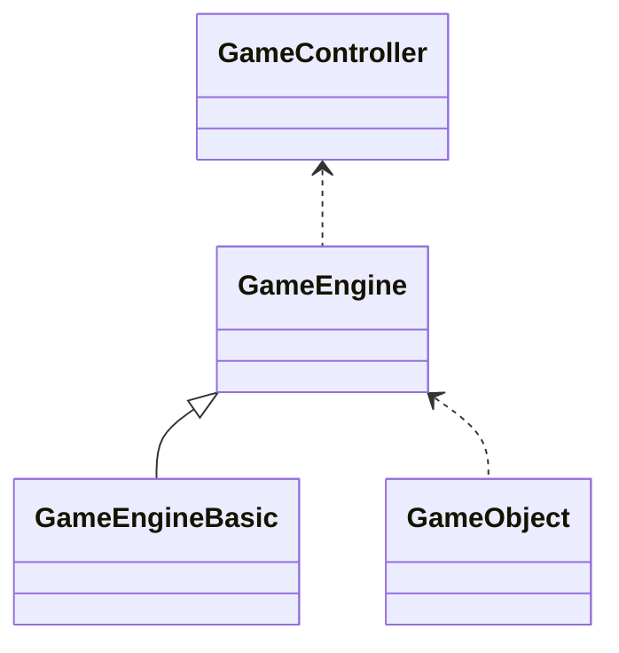
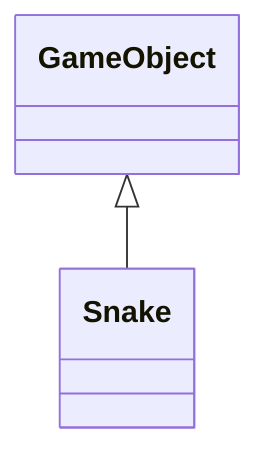
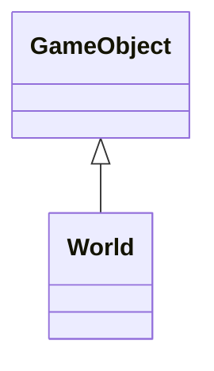
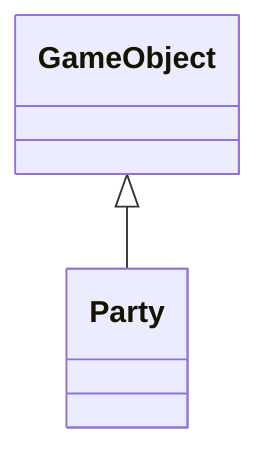
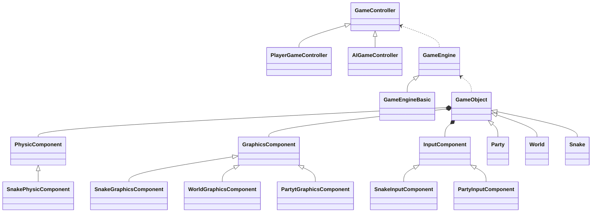

# component

## definitions

General definition : 

> Allow a single entity to span multiple domains without coupling the domains to each other.

Definition from the book :

> A single entity spans multiple domains. To keep the domains isolated, the code for each is placed
> in its own component class. The entity is reduced to a simple container of components.

Personal definition :  

> If an entity handles multiple domains, create separated/isolated components so that this
> entity will incorporate them (like a container) to safely use them.

## explanations

There is not much of additional explanations here, the goal is separate the domains
by having dedicated classes and use them in another class as instance members.

## implementation

### introduction

For the implementation, I will implement a very basic fake game engine.
The goal is not to implement a real game engine but to illustrate the
usefulness of the design pattern component.

The game I have chosen is snake.

I might do a full implementation, but it will be in another project.

#### GameObject

This is the base component of the Game. It has three pointers for the three
main elements : Graphics, Input and Physics.

Although all GameObject won't necessarily have/use all those elements, it might
be a good idea at this point to have them still in place.

#### GameController

The GameController provides the way to get the Inputs either from the player (Keyboard, Gamepad) or from
the AI which will generate random inputs events.

#### GameEngine (simplified)

This is the engine of the game. It will be the access point for the Graphics and Inputs
of the game.

The GameEngine doesn't have the inputs but rely on a GameController to get the Input events.
This way we can have a User controlled GameController when an actual Player is playing and an
AI Controlled GameController when the Game is in Demo mode.

I learned this mechanism in the book [Game Programming Patterns](https://gameprogrammingpatterns.com/) and I liked it very much. Once again it is
a fantastic book !

#### Snake (simplified)

This is the main actor of the game. It will have three components:
- PhysicComponent : to handle the collision between **Food**, **Wall** and **Itself**.
- GraphicsComponent : to handle the rendering of the Snake.
- InputComponent : to handle the behavior of the Snake according to the inputs received.

So it is a game object, but the three composition will be derived class of the base class
PhysicComponent, GraphicsComponent and InputComponent since their behavior will be different.

#### World (simplified)

This is the more or less the level. It will be responsible for rendering the walls and the placing the 
food at random positions on the level once the food has been consumed.

It will have :
- GraphicsComponent : to render the food and the level (walls)

#### Party (simplified)

The Party component will handle the display of the score and making the game pause if needed.
It will have two components:

- GraphicsComponent : to display the score and the message when the game is paused
- InputComponent : to react when the user press the button to make the game pause or resume.

#### Whole diagram

This in my opinion is a good decomposition and presentation of the benefits
of the component pattern. We were able to decompose the game into several classes
each handling a particular aspect of the game.

Now we have to implement it and see if our design was correct.

I will add edit to indicate the changes which will be made along the way.